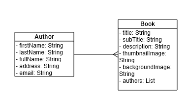

# Back-end Application using Spring Boot - Book Management

## Prerequisite Condition
- Creating a MongoDB replica set using Docker
https://www.sohamkamani.com/blog/2016/06/30/docker-mongo-replica-set/
## Diagram

## How to start project
- Step 1. Start Docker

- Step 2. Start docker-compose.xml file under the core-api module.

``
docker-compose up
``

- Step 3. Build Project

``
mvn clean install
``

- Step 3. Run the BookServiceApplication.

