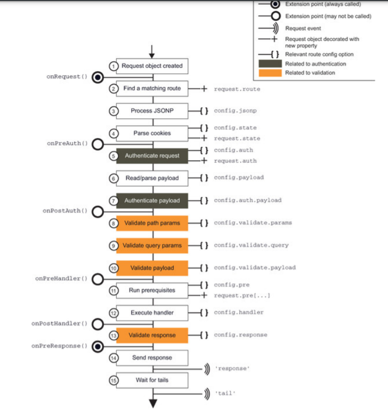

# NodeJS
- Version: I'm using version v15.0.0

# How Node.js works (Reactoer Pattern)
## I/O is slow. I/O is usually not expensive in terms of CPU, but it adds a delay between the moment the request is sent to the device and the moment the operation completes.
## Blocking I/O: not able to handle multiple connections to the same thread (waiting for the response). This is because each I/O operation on a socket will block the processing of any other connection. The traditional approach to solving this problem is to use a separate thread (or process) to handle each concurrent connection.
```JavaScript
// blocks the thread until the data is available
data = socket.read()
// data is available
print(data)
```
## Non-blocking I/O: always return immediately without waiting for data to be read or written. The most basic pattern for dealing with this type of non-blocking I/O is to actively poll the resource within a loop until some actual data is returned. This is called 'busy-waiting'. (not efficient)
```JavaScript
resources = [socketA, socketB, fileA]
while (!resources.isEmpty()) {
  for (resource of resources) {
    // try to read
    data = resource.read()
    if (data === NO_DATA_AVAILABLE) {
      // there is no data to read at the moment
      continue
    }
    if (data === RESOURCE_CLOSED) {
      // the resource was closed, remove it from the list
      resources.remove(i)
    } else {
      //some data was received, process it
      consumeData(data)
    }
  }
}
```
## Event demultiplexing: handle concurent non-blocking resources - synchronous event demultiplexer (also know as event notification interface)

```JavaScript
watchedList.add(socketA, FOR_READ)                            // (1)
watchedList.add(fileB, FOR_READ)
while (events = demultiplexer.watch(watchedList)) {           // (2)
  // event loop
  for (event of events) {                                     // (3)
    // This read will never block and will always return data
    data = event.resource.read()
    if (data === RESOURCE_CLOSED) {
      // the resource was closed, remove it from the watched list
      demultiplexer.unwatch(event.resource)
    } else {
      // some actual data was received, process it
      consumeData(data)
    }
  }
}
```
- The reactor pattern: The main idea behind the reactor pattern is to have a handler associated with each I/O operation. A handler in Node.js is represented by a callback (or cb for short) function. 
https://stackoverflow.com/questions/56622353/how-does-reactor-pattern-work-in-node-js

## Message queue

### process.nextTick()
When we pass a function to process.nextTick(), we instruct the engine to invoke this function at the end of the current operation, before the next event loop tick starts:
```JavaScript
process.nextTick(() => {
  //do something
})
```
Calling setTimeout(() => {}, 0) will execute the function at the end of next tick, much later than when using nextTick() which prioritizes the call and executes it just before the beginning of the next tick.

### process.setImmediate()
When you want to execute some piece of code asynchronously, but as soon as possible, one option is to use the setImmediate() function provided by Node.js

# Node essential patterns

## 1. HTTP server: 
- The 'http' provides the functionality to module to create a HTTP server by using http.createServer() method.
```JavaScript
const server = http.createServer((req, res) => {});
```

## 2. Debugging Your NodeJS Application
- You can use the node-inspector. Run this command to install it via npm:
npm install -g node-inspector

- Then you can debug your application using
node-debug app.js

## 3. How to get a basic HTTPS web server up and running!
https://riptutorial.com/node-js#how-to-get-a-basic-https-web-server-up-and-running-

## 4. Async in NodeJS: using with callback
- Callback: What are callbacks? Callbacks are basically just functions that you pass to other functions.
https://nodejs.org/en/knowledge/getting-started/control-flow/what-are-callbacks/
```JavaScript
function callback(err, result [, arg1[, ...]])
```
### 4.1. Callbacks: simple, obvious, …hellish
- Callback Hell: How do I fix callback hell?
http://callbackhell.com/
```JavaScript
let leftToDo = 2; // or use booleans doneA and doneB instead...
doA(argA, (errA, resA) => {
  // ...
  leftToDo--;
  // ...to do after A
  if (leftToDo === 0) {
    todoAfterAB();
  }
});
doB(argB, (errB, resB) => {
  // ...
  leftToDo--;
  // ...to do after B
  if (leftToDo === 0) {
    todoAfterAB();
  }
});
function todoAfterAB() {
  // ...
}
```

### 4.2. Async module: is not a good solution for "Callback hell" because we still need something nesting.
```JavaScript
const async = require('async');
async.parallel(
  [
    doA, // if A needs no args and no special logic afterwards
    doB.bind(null, argB), // if B needs argB
    (callback) => { // if C needs both arg and special logic
      // ...stuff to do immediately before C
      doC(argC, (errC, resC) => {
        // ...stuff to do immediately after C
        callback(resC);
      });
    }
  ],
  (err, results) => { // callback
    // ...stuff to do after A, B and C are all done
  }
);
```
The name, “parallel”. Because as you know Node.js is single threaded, so the only thing happening in parallel is the IO, done outside Javascript code

### 4.3 Promises: promise is just an enhancement to callback functions in Node.js. During the development lifecycle, there may be an instance where you would need to nest multiple callback functions together. This can get kind of messy and difficult to maintain at a certain point in time. In short, a promise is an enhancement to callbacks that looks towards alleviating these problems.
```JavaScript
var promise = doSomethingAync()
promise.then(onFulfilled, onRejected)
```
- "doSomethingAync" is any callback or asynchronous function which does some sort of processing
- This time, when defining the callback, there is a value which is returned called a "promise."
- When a promise is returned, it can have 2 outputs. This is defined by the 'then clause'. Either the operation can be a success which is denoted by the 'onFulfilled' parameter. Or it can have an error which is denoted by the 'onRejected' parameter.

Creating a custom promise: A custom promise can be created by using a node module called 'q.'. It is used to convert any function into a function that would return a promise

### 4.4 Async/Await: to use async/await, you actually need code that returns promises. 
```JavaScript
// ...
async function showFileContents() {
  let data = await getFileContents('hello.txt');
  console.log('File contents:', data);
}
showFileContents();
```

- Handle Error
```JavaScript
// ...
async function showFileContents() {
  try {
    let data = await getFileContents('hello.txt');
    console.log('File contents:', data);
  } catch (err) {
    console.error("Error reading file:", err);
  }
}
showFileContents();
```

The important links between promises and async/await are:
+ everything you await for is (usually) a Promise
+ the returned value from an async function is a Promise, so you can use .then() function.
```JavaScript
showFileContents().then(() => console.log('We did it!'))
```

## 5. Event Emitter
https://medium.com/edge-coders/understanding-node-js-event-driven-architecture-223292fcbc2d

### 5.1 Understanding Node.js Event-Driven Architecture
- Most of Node’s objects — like HTTP requests, responses, and streams — implement the EventEmitter module so they can provide a way to emit and listen to events.

### 5.2 The EventEmitter Module
The EventEmitter is a module that facilitates communication between objects in Node. EventEmitter is at the core of Node asynchronous event-driven architecture. Many of Node’s built-in modules inherit from EventEmitter.
The concept is simple: emitter objects emit named events that cause previously registered listeners to be called. So, an emitter object basically has two main features:
- Emitting name events.
- Registering and unregistering listener functions.
```JavaScript
const EventEmitter = require('events');

class WithLog extends EventEmitter {
  execute(taskFunc) {
    console.log('Before executing');
    this.emit('begin');
    taskFunc();
    this.emit('end');
    console.log('After executing');
  }
}

const withLog = new WithLog();

withLog.on('begin', () => console.log('About to execute'));
withLog.on('end', () => console.log('Done with execute'));

withLog.execute(() => console.log('*** Executing task ***'));
```
- Events Arguments and Errors
+ If we register a listener for the special error event, the error will be reported but the node process will not crash and exit.
+ The other way to handle exceptions from emitted errors is to register a listener for the global uncaughtException process event. However, catching errors globally with that event is a bad idea.
```JavaScript
process.on('uncaughtException', (err) => {
  // something went unhandled.
  // Do any cleanup and exit anyway!

  console.error(err); // don't do just that.

  // FORCE exit the process too.
  process.exit(1);
});
```
+ Using .once() method to catch all error error at the same time. This method signals to invoke the listener just once, not every time it happens.

- Order of Listeners: If we register multiple listeners for the same event, the invocation of those listeners will be in order. The first listener that we register is the first listener that gets invoked. Using 'prependListener' method to trigger event if there are more than one listener.

## 6. Stream
- Streams are one of the fundamental concepts that power Node.js applications. They are data-handling method and are used to read or write input into output sequentially.
- Streams are a way to handle reading/writing files, network communications, or any kind of end-to-end information exchange in an efficient way.
- What makes streams unique, is that instead of a program reading a file into memory all at once like in the traditional way, streams read chunks of data piece by piece, processing its content without keeping it all in memory.
- 
### 6.1 There are 4 types of streams in Node.js: Writable, Readable, Duplex and Transform

## 7. Expose functionality from a Node.js file using exports

# HAPI - https://livebook.manning.com/book/hapi-js-in-action/chapter-1/23

## What is hapi?
Hapi is an open source framework for building web applications with Node. HAPI sits between Node and your own application’s code .providing an abstraction layer for working with HTTP requests and responses.

## What makes hapi special?
- It's NodeJS
- Strong focus on modularity helps teams
- Configuration-driven features
- It’s really quick to get started
- It’s open source
- It’s been battle-tested in production

Express vs HAPI:
1. It is easier to define route.
2. Plugin and MiddleWares

## The building blocks of hapi


## When you should use hapi

### JSON APIs: Hapi’s extensive feature set—including routing, input and output validation, authentication, caching, and automatic documentation—makes building APIs with hapi a pleasurable experience.
- Static or database-driven websites
- Single-page applications
- Proxies

## When you shouldn’t use hapi
- JavaScript code in a Node app runs in only a single OS thread, it’s not the right choice for CPU-intensive applications, so it wouldn’t make sense to write things like video encoders, AI software, or 3D-rendering applications with hapi.
- Using hapi as a web front end to those systems, or from using native modules for node.js.
- hard real-time applications

## Authentication
### Scheme vs Strategies
- Schemes are a way of handling authentication within hapi.
- We use strategies to implement authentication schemes into your application.
https://hapi.dev/tutorials/auth/?lang=en_US

# Chapter 4. Routes and handlers in-depth
## Route methods
## Parameterized paths
## How hapi picks a route?
## BUILDING CUSTOM HANDLERS
- What is Vision in hapi? Vision is a templates rendering plugin for hapi.js
- Engines? Path?
## Route prerequisites
- which help to simplify request processing workflows involving multiple steps that must execute sequentially or in parallel.
- Ex: using rout prerequisites to decrypt a message.
- Here are more ideas of where you could apply route prerequisites. Why not try building some yourself to help improve your skills with pres?
1. Fetch tweets using the Twitter API in a pre, then render these in a list inside the handler.
2. Geolocate a user inside a pre using their IP address with https://freegeoip.net and log this in the handler.
3. Create a workflow that combines the previous two examples to show the user a list of tweets about their current location.
4. Extend your solution to exercise 3 by also logging the user’s IP address and location to a file. Note that this step can run in parallel to fetching the tweets.

## MANAGING FILE UPLOADS TO HAPI APPLICATIONS
1. Using data output: read the file contents into memory (can not get file name)
2. Using stream output: get the files as streams
maxBytes: default 1MB
timeout: default 10 seconds

# Chapter 5. Understanding requests and responses
## Understanding the hapi.js request lifecycle



## Using extension points
- Which extension point should I use?
+ on­Request extension point comes before payload reading and parsing occurs, or need to modifies the URL
+ onPostAuth: access to the request payload in your extension function

## Examining the reply interface in depth (in hapi 17+, it is changed to response toolkit https://hapi.dev/api/?v=20.1.2#response-toolkit)

## Looking at the response object (There are some new methods in hapi 17+ https://hapi.dev/api/?v=20.1.2#response-properties)
HOW TO STREAM FILE DOWNLOADS IN NODE.JS WITH GOT?
https://philna.sh/blog/2020/08/06/how-to-stream-file-downloads-in-Node-js-with-got/
- If the server you are downloading from doesn’t return a Content-Length header for the file, then total will be undefined and percent will be 0 until the download is complete.

## Dealing with handling and communicating errors

# Chapter 6. Validation with Joi

## Working with Joi
```JavaScript
const schema = Joi.object({
    a: Joi.number()
});

const value = {
    a: '123'
};

const result = schema.validate(value);
```
Returns an object with the following keys:
- value - the validated and normalized value.
- error - the validation errors if found.
- warning - the generated warnings if any.
- artifacts - a Map containing any passing rules' artifacts and their corresponding array of paths.

## Adding validation to hapi.js apps
## Customizing validation errors
## Consuming and presenting validation errors

# Chapter 7. Building modular applications with plugins
- Plugins can contain routes, server methods, extension points, custom handlers, and decorators.
- Normally, most plugins are either containers of business logic or utilities. 

## Defining plugins and why you should use them
## Creating and loading plugins
## Building applications in a modular way using plugins
## Communicating and sharing data between plugins


### What is Glue utility?
https://www.npmjs.com/package/glue
- Glue is a utility designed for use with hapi (it’s not a hapi plugin, but a normal package from npm) that does this legwork for us.
- It lets you define an entire application in a configuration object called a manifest. A manifest is nothing special—it’s a plain­ old JavaScript object with a specific set of properties.
- Glue takes a manifest and builds a server with all the connections and plugins loaded how you specified. It’s pretty awesome to see it in action.

### Smart configuration with the Confidence utility
- Confidence is a hapi utility for capturing more complex configuration requirements entirely in a single JavaScript object (or a JSON document)


Run App by env: NODE_ENV=production node ./src/index.js
https://www.twilio.com/blog/working-with-environment-variables-in-node-js-html

# Chapter 8. Cache me if you can
## Managing client­side caching
## Introducing Catbox
## Server­side caching with hapi (Using Redis or Memcached)

# Chapter 9. Authentication and security
## 9.1. Authentication in depth
- The way that you’ve decided users should authenticate with a route, is called the authentication scheme
- A strategy is a named instance of a scheme that you can use in hapi to authenticate requests to a route

### Which authentication scheme should I choose?
- hapi­auth­basic — Supports HTTP basic authentication. Usable for both websites and APIs. Recommended for use only over SSL/TLS as username/password are sent as cleartext over the network.
- hapi­auth­cookie — Implements cookie authentication and basic session support. Highly useful for websites. Often coupled with form­based login.
- hapi­auth­hawk — New authentication scheme for APIs created by Eran Hammer (author of hapi). Intended to be an improvement over HTTP Digest authentication. Relies on a shared secret key between client and server

# Chapter 7: Scalability and Architechtural Patterns
- Load balancing with cluster
- Zero-downtime restart
- Dealing with stateful communications
- Sharing the state across multiple instances
- Sticky load balancing
- Scaling with a reverse proxy
- Using a Service Registry


# Chapter 8: Messaging and Integration Patterns

## Using Kafka-Node to build a chat application https://github.com/SOHU-Co/kafka-node


